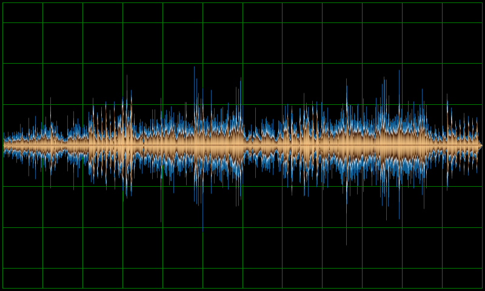
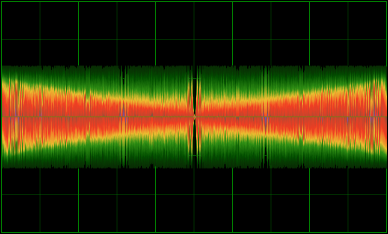

# wav2png

Renders a WAV file as a PNG image, with options to draw a grid, custom colouring and anti-aliasing. 

There are three implementations:

- A command line version (in the _go_ subdirectory), mostly intended for scripting and batch processing
- An online version implemented by compiling this library to WASM, which can be found
  [here](https://transcriptaze.github.io/W2P.html).
- An under development WebGPU implementation (in the _webgpu_ directory) for a faster interactive experience.

## Raison d'être

wav2png was initially created as a Go utility library to render an audio file as an anti-aliased waveform for a
WASM project - it just seemed like a good idea to add a standalone command line version.

## Releases

| *Version* | *Description*                                                                                            |
| --------- | -------------------------------------------------------------------------------------------------------- |
| v1.1.0    | Added `wav2mp4` command line utility                                                                     |
| v1.0.0    | Initial release                                                                                          |

## Installation

Platform specific executables can be downloaded from the [releases](https://github.com/transcriptaze/wav2png/releases) 
page. Installation is straightforward - download and extract the archive for your platform and place the executables in 
a directory in your PATH. 

### Samples

## References & Related Projects

1. [Audio File Format Specifications](http://www-mmsp.ece.mcgill.ca/Documents/AudioFormats/WAVE/WAVE.html)
2. [SoX](http://sox.sourceforge.net)
3. [WaveFile Gem](https://wavefilegem.com/how_wave_files_work.html)
4. [DirectMusic: wav2png](https://directmusic.me/wav2png)
5. [Shulz Audio: wav2png](https://schulz.audio/products/wav2png)
6. [iconmonstr](https://iconmonstr.com/sound-wave-2-png)
7. [BBC](https://github.com/bbc/audiowaveform)
8. [BBC CLI](https://github.com/marc7806/bbc-audiowaveform-cli-wrapper)
9. [stackoverflow](https://stackoverflow.com/questions/4468157/how-can-i-create-a-waveform-image-of-an-mp3-in-linux)
10. [github:waveform](https://github.com/andrewrk/waveform)
